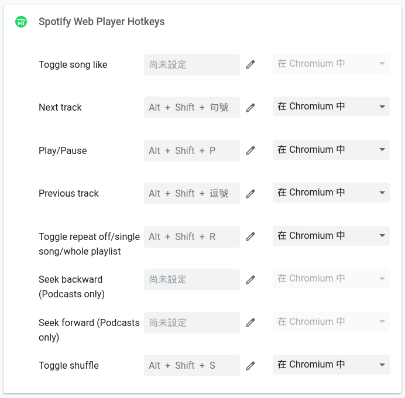

# SpotifyPi

## Setup

1. Run `ifconfig` and write down the IP address of the Raspberry Pi.
    ```
    $ ifconfig
    ```
2. Update Raspberry Pi OS:
    ```
    $ sudo apt update
    $ sudo apt upgrade
    ```
3. Install Widevine DRM and reboot:
    ```
    $ sudo apt install libwidevinecdm0
    $ sudo reboot
    ```
4. Open Chromium, install `Spotify Web Player Hotkeys` extension, and set shortcuts:
    
    - Next track: `alt` + `shift` + `.`
    - Play/Pause: `alt` + `shift` + `p`
    - Previous track: `alt` + `shift` + `,`
    - Toggle repeat off/single song/whole playlist: `alt` + `shift` + `r`
    - Toggle shuffle: `alt` + `shift` + `s`
    
5. Clone this repo, and `cd` to repo directory:
    ```
    $ git clone https://github.com/wlelab/SpotifyPi.git
    $ cd SpotifyPi
    ```
6. Run `install.sh` and reboot:
    ```
    $ chmod 755 install.sh
    $ sudo ./install.sh
    $ sudo reboot
    ```


## Remote control via WebSocket

1. On other PC, clone this repo, and `cd` to repo directory:
    ```
    $ git clone https://github.com/wlelab/SpotifyPi.git
    $ cd SpotifyPi
    ```
2. Install websockets using pip3:
    ```
    $ pip3 install websockets
    ```
3. Run test.py:
    ```
    $ python3 test.py

    Usage: test.py [URL] [command]

    command list:
        get_volume - get current volume value
        set_volume [number] - set volume, number value range: 0 ~ 100
        toggle_play_pause - toggle play / pause
        next_track - next track
        prev_track - previous track
        toggle_shuffle - toggle shuffle
        toggle_repeat_state - toggle repeat off / single song / whole playlist
        shutdown - shutdown machine
        reboot - reboot machine
    ```

    test.py's parameters format:
    ```
    $ python3 test.py ws://<Your Raspberry Pi IP address>:<Port> <Command>
    ```
4. For example, to set the volume:
    ```
    $ python3 test.py ws://192.168.1.110:9487 set_volume 50
    ```
    (Assume that the IP address of the Raspberry Pi is 192.168.1.110)

5. For example, toggle Play / Pause:
    ```
    $ python3 test.py ws://192.168.1.110:9487 toggle_play_pause
    ```

